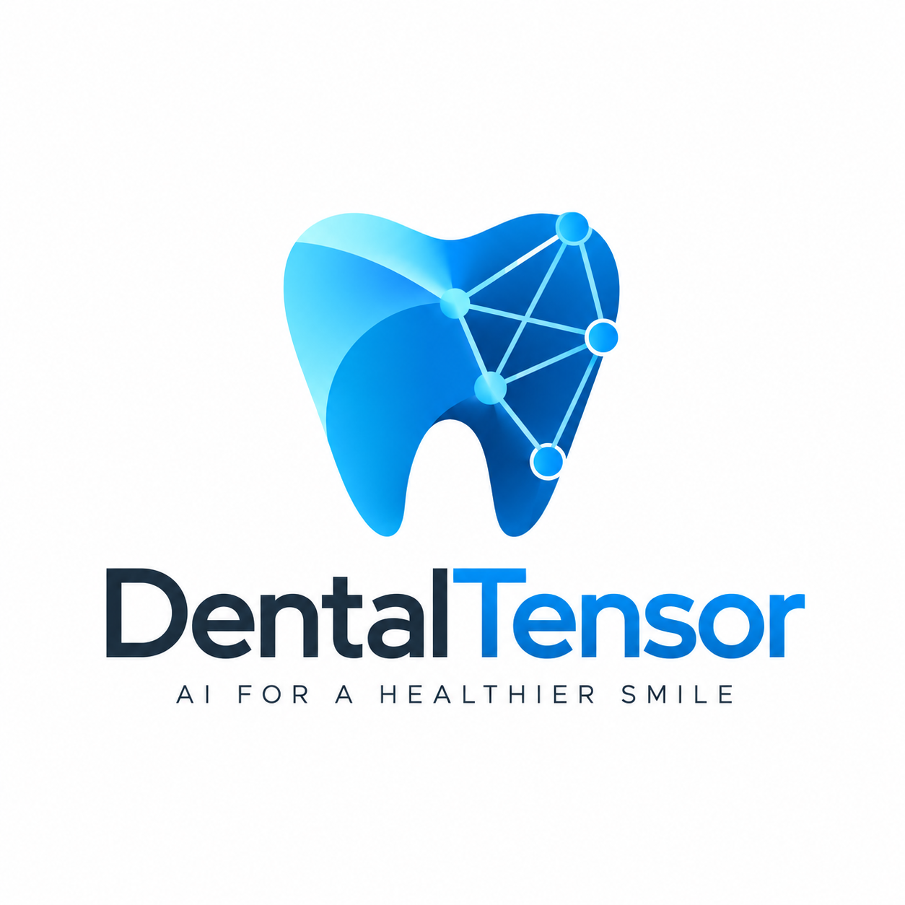
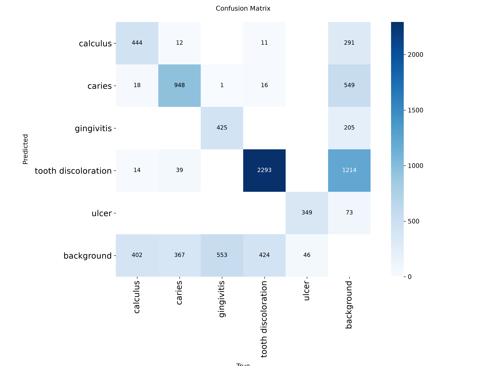

<p align="center">
  
</p>

# DentalTensor Vision

**Pre-trained open-source computer vision for detecting visible oral findings.**

DentalTensor Vision v1.0 is a custom-trained oral pathology detection model built on the Ultralytics YOLO11n architecture. It detects visible oral findings—including calculus, caries, gingivitis, tooth discoloration, and oral ulcers—directly from standard 2D photographs.

Developed by **Nathan Asif**. First production integration: **DaantShaant**.

<p align="left">
  <a href="https://python.org"></a>
  <a href="https://github.com/Nathan-Asif/DentalTensor-Vision/releases"></a>
  <a href="LICENSE"></a>
  <a href="https://github.com/ultralytics/ultralytics"></a>
  <a href="https://github.com/Nathan-Asif/DentalTensor-Vision/actions/workflows/tests.yml"></a>
</p>

<table>
<tr>
<td align="center"><b>10,698</b><br>Training Images</td>
<td align="center"><b>5</b><br>Finding Classes</td>
<td align="center"><b>0.687</b><br>mAP@50</td>
<td align="center"><b>0.680</b><br>Precision</td>
<td align="center"><b>0.666</b><br>Recall</td>
</tr>
</table>

> **Pre-trained and ready for local inference. No training, dataset, cloud account, or API key required.**<br>
> DentalTensor Vision v1.0 ships with learned weights (`models/dentaltensor_vision_v1.0.pt`). Users install the package, load the pre-trained checkpoint, pass an oral image, and receive structured visual findings.

---

## Quick Start

### Installation

Clone the repository and install the package locally:

```bash
git clone https://github.com/Nathan-Asif/DentalTensor-Vision.git
cd DentalTensor-Vision

python -m venv .venv

# Windows
.venv\Scripts\activate

# Linux / macOS
source .venv/bin/activate

pip install -e .
```

### Run Prediction (CLI)

Run inference directly on any intraoral photograph:

```bash
# Formatted table output
dentaltensor predict path/to/image.jpg

# Formatted JSON output
dentaltensor predict path/to/image.jpg --json
```

### Run Prediction (Python)

```python
from dentaltensor import DentalTensorVision

# Load model with pre-trained weights
model = DentalTensorVision()

# Run inference
result = model.predict("path/to/image.jpg")

# Print structured JSON output
print(result.to_json(indent=2))
```

---

## Python API

The `dentaltensor` package provides a lightweight Python interface for embedding oral visual screening into clinical tools, research pipelines, and mobile backends.

### Basic Usage

```python
from dentaltensor import DentalTensorVision

model = DentalTensorVision()
result = model.predict("patient_photo.jpg")

for finding in result.findings:
    print(f"Finding: {finding.class_name}")
    print(f"  Confidence: {finding.confidence:.2%}")
    print(f"  Bounding Box [x1, y1, x2, y2]: {finding.bbox}")
    print(f"  Normalized Box: {finding.bbox_normalized}")
    print(f"  Threshold Applied: {finding.threshold_used}")
```

### Device Selection

By default, DentalTensor Vision uses `device="auto"`, which detects compatible local GPU acceleration via PyTorch and falls back to CPU execution if unavailable.

```python
# Automatic device selection (default)
model = DentalTensorVision(device="auto")

# Force standard CPU execution (no GPU required)
model = DentalTensorVision(device="cpu")

# Explicit CUDA acceleration
model = DentalTensorVision(device="cuda")
```

### Custom Confidence Thresholds

To override production class-specific cutoffs with a custom minimum confidence:

```python
# Apply a global minimum confidence cutoff of 0.70
result = model.predict("patient_photo.jpg", threshold=0.70)
```

### Input Sources

The `predict()` method accepts file paths (as strings or `pathlib.Path` objects), NumPy arrays (`ndarray`), and PIL `Image` instances:

```python
from pathlib import Path
from PIL import Image

# Path object
result = model.predict(Path("data/test.png"))

# PIL Image
image = Image.open("data/test.png")
result = model.predict(image)
```

---

## CLI

DentalTensor includes an offline command-line interface: `dentaltensor`.

```bash
# Predict and display visual table
dentaltensor predict image.jpg

# Output structured JSON
dentaltensor predict image.jpg --json

# Save JSON findings to disk
dentaltensor predict image.jpg --output findings.json

# Specify compute device
dentaltensor predict image.jpg --device cpu
dentaltensor predict image.jpg --device cuda

# Override confidence cutoff
dentaltensor predict image.jpg --threshold 0.60

# Inspect model checkpoint, parameters, and active thresholds
dentaltensor info

# Print package version
dentaltensor version
```

---

## Example Output

Inference returns a structured `DentalVisionResult` schema containing detected bounding boxes, calibrated class labels, confidence scores, image metadata, and execution latency:

```json
{
  "model": "DentalTensor Vision",
  "version": "1.0",
  "findings": [
    {
      "class_name": "caries",
      "confidence": 0.71,
      "bbox": [145.2, 210.5, 230.8, 295.1],
      "threshold_used": 0.55,
      "bbox_normalized": [0.2269, 0.4385, 0.3606, 0.6148]
    },
    {
      "class_name": "calculus",
      "confidence": 0.64,
      "bbox": [280.0, 310.2, 340.5, 365.0],
      "threshold_used": 0.35,
      "bbox_normalized": [0.4375, 0.6463, 0.5320, 0.7604]
    }
  ],
  "image_metadata": {
    "width": 640,
    "height": 480,
    "channels": 3,
    "format": "RGB",
    "source": "image.jpg"
  },
  "inference_ms": 42
}
```

---

## Supported Findings

DentalTensor Vision v1.0 classifies and localizes five visible oral findings:

| Class Name | Canonical Key | Visual Finding Description | Production Cutoff |
|---|---|---|:---:|
| Calculus | `calculus` | Supragingival and visible subgingival dental calculus / tartar deposits along the gingival margin | `0.35` |
| Caries | `caries` | Visible enamel cavitation, dark pit/fissure lesions, and coronal structural defects | `0.55` |
| Gingivitis | `gingivitis` | Marginal gingival erythema, edema, and localized papillary inflammation | `0.50` |
| Tooth Discoloration | `tooth_discoloration` | Extrinsic surface staining, fluorosis patterns, and pronounced enamel discoloration | `0.65` |
| Oral Ulcer | `oral_ulcer` | Aphthous lesions, oral mucosal ulcerations, and circumscribed mucosal breaks | `0.65` |

---

## How It Works

DentalTensor Vision executes completely locally and offline. The pipeline consists of direct image ingestion, single-pass forward detection, and empirical threshold calibration.

```
                    INPUT IMAGE (JPEG / PNG / WebP)
                                  │
                                  ▼
                     ZERO-DISTORTION PREPROCESSING
                    (RGB decode, preserved fidelity)
                                  │
                                  ▼
                       DENTALTENSOR VISION v1.0
                  (Custom YOLO11n weights, 640x640)
                                  │
                                  ▼
                         BOUNDING BOX ENGINE
                     (Raw predictions & class scores)
                                  │
                                  ▼
                     CLASS-SPECIFIC CALIBRATION
            (Calculus: 0.35 | Caries: 0.55 | Gingivitis: 0.50
             Discoloration: 0.65 | Oral Ulcer: 0.65)
                                  │
                                  ▼
                      STRUCTURED FINDINGS (JSON)
              (Bounding boxes, confidence, pixel metadata)
```

### Zero-Distortion Ingestion Pipeline

During development and validation inside DaantShaant, aggressive preprocessing filters—such as Contrast Limited Adaptive Histogram Equalization (CLAHE) and secondary lossy JPEG re-compression—were empirically verified to suppress subtle pathology margins and reduce detector recall.

DentalTensor Vision implements a zero-distortion ingestion pipeline:
- Decodes image bytes directly into standard RGB arrays.
- Preserves native dynamic range and subtle tonal gradients essential for identifying early caries and gingival erythema.
- Avoids contrast-stretching artifacts that produce false-positive discoloration predictions.

---

## Model Performance

All reported metrics represent verified evaluations on held-out test splits (1,070 unseen dental images):

| Metric | Score | Note |
|---|:---:|---|
| **mAP@50** | **0.687** | Mean Average Precision at 0.50 IoU intersection |
| **mAP@50-95** | **0.360** | Mean Average Precision across IoU thresholds 0.50:0.95 |
| **Precision** | **0.680** | Macro precision across all 5 classes |
| **Recall** | **0.666** | Macro recall across all 5 classes |
| **Parameters** | 2,590,815 | Compact footprint for edge and CPU deployment (verified) |
| **GFLOPs** | 6.5 | Computation at standard 640×640 input resolution (verified) |
| **Checkpoint Size** | 5.45 MB | Shipped in `models/dentaltensor_vision_v1.0.pt` |

### Training Diagnostics

The model converged smoothly over its training schedule, demonstrating strong class separation on the confusion matrix:

<p align="center">
  
  
</p>

---

## Confidence Calibration

Object detectors trained on clinical images exhibit non-uniform score distributions across classes. Using a single global confidence cutoff either admits excessive false positives for common findings or suppresses true positives for subtle lesions.

DentalTensor Vision applies an empirical, two-stage calibration strategy:

1. **Calculus (`0.35`)**: Tartar deposits along the gingival line often blend with tooth enamel under diffuse lighting. A sensitive cutoff preserves detection of early supragingival calculus.
2. **Caries (`0.55`)**: Deep occlusal fissures, natural pits, and dental amalgams can visually resemble decay. A conservative threshold suppresses false alarms on benign anatomy.
3. **Gingivitis (`0.50`)**: Balanced operating point detecting marginal gum redness and edema while filtering lighting-induced pink reflections.
4. **Tooth Discoloration (`0.65`)**: Natural shade variations across canine vs. incisor teeth require an elevated cutoff to prevent normal dentition from triggering alerts.
5. **Oral Ulcer (`0.65`)**: High-specificity cutoff targeting clear mucosal breaks and aphthous lesions.
6. **Global Fallback (`0.50`)**: Default threshold for uncalibrated or out-of-distribution queries.

---

## Architecture

DentalTensor Vision v1.0 is a custom-trained oral pathology object detection model built on the Ultralytics YOLO11n architecture.

- **Base Architecture**: Ultralytics YOLO11n (nano detection model)
- **Parameters**: 2,590,815 (verified via checkpoint introspection)
- **FLOPs**: 6.5 GFLOPs at standard 640×640 input resolution
- **Execution**: Designed for local edge and CPU execution, removing the need for dedicated GPU hardware in screening clinics.

---

## Training Provenance

The model development process is distinct from runtime usage:

```
MODEL DEVELOPMENT (Completed):
10,698 dental images ──► Task-specific fine-tuning ──► Checkpoint: dentaltensor_vision_v1.0.pt

RUNTIME INFERENCE (User Workflow):
User photo + dentaltensor_vision_v1.0.pt ──► DentalTensor Vision ──► Structured visual findings
```

### Dataset Provenance (Research Transparency)
- **Primary Pathology Dataset**: 10,698 clinical dental photographs (Train: 8,558, Validation: 1,070, Test: 1,070) with 62,720 annotated bounding boxes and 570 empty-label negative control images. Sourced under CC BY 4.0.
- **Hard-Negative Mining**: Dedicated clean-dentition pools were utilized during training iterations to expose the model to healthy teeth, preventing benign enamel translucency from generating false-positive discoloration or caries detections.
- **Pre-trained Distribution**: The training dataset is not required at runtime. The checkpoint ships directly inside the repository.

---

## Inference Requirements

DentalTensor Vision is designed for minimal operational overhead:

- **Compute**: Standard x86_64 or ARM64 CPU. Dedicated GPU hardware (NVIDIA CUDA) is supported but not required.
- **Storage**: ~20 MB for package code and weights (`models/dentaltensor_vision_v1.0.pt` is 5.45 MB).
- **Network**: Zero external network requests during inference. All processing is 100% offline and local.
- **Python**: >=3.9 (tested on Python 3.9, 3.10, 3.11, and 3.12).

---

## Limitations and Medical Disclaimer

> **IMPORTANT: Not a Certified Medical Device**<br>
> DentalTensor Vision v1.0 is an artificial intelligence research and visual screening tool. It is **not** a certified medical diagnostic device and does not provide clinical diagnoses. It is designed to assist screening workflows and must never replace direct clinical examination, diagnostic radiographs, or treatment planning by a licensed dental professional.

- **Visible-Light Photography Limitations**: DentalTensor operates exclusively on standard 2D photographic images of visible oral surfaces. Some dental conditions cannot be reliably assessed from visible-light photographs alone (such as interproximal caries between tight contacts, subgingival calculus concealed beneath the gumline, root resorption, or periapical conditions) and may require clinical examination, radiography, or other diagnostic methods.
- **Visual Confounders**: Detection performance can vary with image quality, lighting, framing, motion blur, saliva reflections, dental restorations (amalgam, composite, crowns), and capture conditions.
- **Screening Nature**: DentalTensor Vision is a visual screening and detection model. It does not guarantee detection of every condition, and visual photographs cannot represent all clinically relevant dental information. Output bounding boxes denote visible regions of interest for professional evaluation, not clinical diagnoses.

---

## DaantShaant Integration

DentalTensor was conceived, trained, and productized by Nathan Asif as the core vision engine for **DaantShaant**, an oral health screening and care-navigation platform developed for the Alibaba Cloud Bano Qabil Hackathon 2026.

Within DaantShaant, DentalTensor Vision functions as the standalone perception layer that analyzes oral photographs and supplies structured findings to downstream user-facing screening workflows.

---

## Project Structure

```
DentalTensor-Vision/
├── assets/
│   ├── dentaltensor-logo.png      # Official project logo
│   └── metrics/
│       ├── confusion_matrix.png   # Audited class confusion matrix
│       └── training_results.png   # Training loss and mAP convergence curves
├── docs/                          # Technical documentation
├── examples/
│   ├── python_usage.py            # Complete Python SDK usage walkthrough
│   └── test_dentaltensor.py       # Quick verification script
├── models/
│   └── dentaltensor_vision_v1.0.pt # Shipped pre-trained model weights (5.45 MB)
├── src/
│   └── dentaltensor/
│       ├── cli.py                 # Offline CLI commands
│       ├── config.py              # Canonical constants & threshold definitions
│       ├── schemas.py             # Pydantic result & finding data schemas
│       ├── vision.py              # Main DentalTensorVision engine class
│       └── inference/
│           ├── detector.py        # YOLO11n model loader & raw inference engine
│           ├── postprocessing.py  # Coordinate normalization & metadata extraction
│           ├── preprocessing.py   # Zero-distortion image loading & validation
│           └── thresholds.py      # Class-specific confidence filtering logic
├── tests/                         # Unit and regression test suite (current release validation: 40 tests passed)
├── CHANGELOG.md                   # Version release notes
├── CITATION.cff                   # Citation metadata in CFF format
├── CONTRIBUTING.md                # Contribution guidelines
├── LICENSE                        # AGPL-3.0 license text
├── MODEL_CARD.md                  # Comprehensive machine learning model card
├── NOTICE.md                      # Attribution and third-party notices
├── pyproject.toml                 # Packaging, dependencies, and entrypoints
└── ROADMAP.md                     # Architecture roadmap (v1.x, v2.0, v3.0)
```

---

## Roadmap

DentalTensor follows an explicit modular evolution plan:

- **v1.x (Current Release)**: Pre-trained local inference, CPU/acceleration execution, Python SDK, offline CLI, calibrated class thresholds, zero-distortion image pipeline.
- **v2.0 (High-Throughput Deployment)**: Optimized CUDA execution, batch processing pipelines, standardized ONNX Runtime export, TensorRT acceleration, and optional microservice deployment adapters.
- **v3.0 (Pluggable Report Generation)**: Optional provider adapters (Qwen, Gemini, OpenAI, Claude, local LLMs) for synthesizing patient explanations and summaries. *The core DentalTensor Vision model will always remain usable independently without requiring any LLM.*

See [ROADMAP.md](ROADMAP.md) for full milestone specifications.

---

## License

DentalTensor Vision is released under the **GNU Affero General Public License v3.0 (AGPL-3.0-only)**. See [LICENSE](LICENSE) for the full license text.

### Third-Party Attribution
DentalTensor Vision v1.0 is built on the Ultralytics YOLO11n architecture. The underlying YOLO architecture and deep learning framework were created and maintained by [Ultralytics](https://github.com/ultralytics/ultralytics). Comprehensive third-party notices are documented in [NOTICE.md](NOTICE.md).

---

## Citation

If you use DentalTensor Vision in your research, clinical studies, or software applications, please cite:

```bibtex
@software{asif_dentaltensor_vision_2026,
  author       = {Nathan Asif},
  title        = {DentalTensor Vision: Pre-Trained Oral Pathology Computer Vision},
  version      = {1.0.0},
  year         = {2026},
  url          = {https://github.com/Nathan-Asif/DentalTensor-Vision}
}
```

---

## Contributing

Contributions are welcome. Please read [CONTRIBUTING.md](CONTRIBUTING.md) for details on our code style, test requirements, and pull request workflow.

---

## Developer

**Nathan Asif**<br>
Founder & Developer, DentalTensor<br>
Creator, DaantShaant<br>
Repository: [DentalTensor-Vision](https://github.com/Nathan-Asif/DentalTensor-Vision)
